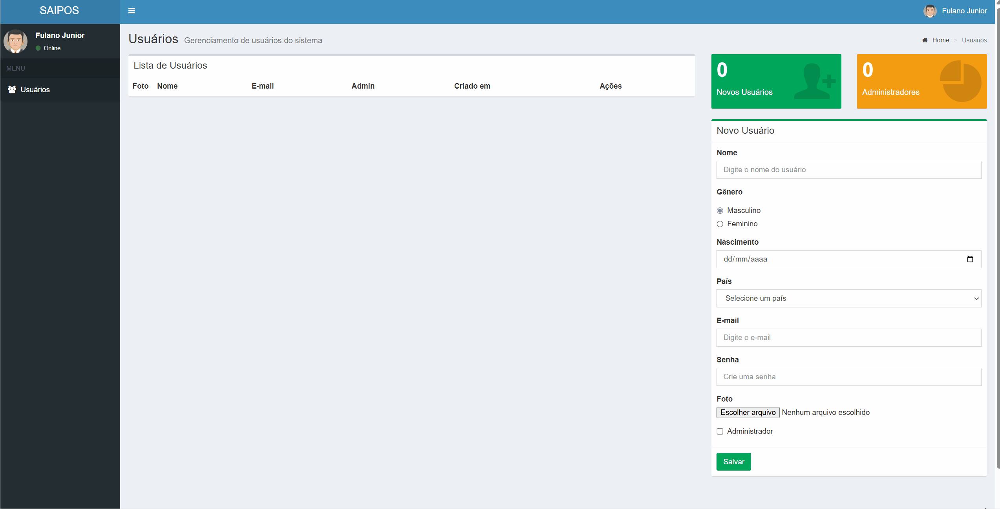

# <h1 align="center"> Projeto Usuários </h1>

<p align="center">
  <strong>Sistema de gerenciamento de usuários desenvolvido com JavaScript, HTML, Bootstrap e AdminLTE.</strong>
</p>

<p align="center">
  Projeto criado para praticar manipulação do DOM, orientação a objetos com JavaScript e gerenciamento de usuários em uma interface administrativa.
</p>

<p align="center">
  
  
  
  
</p>

---

## Sobre o projeto

O **Projeto Usuários** é uma aplicação web voltada para o gerenciamento de usuários através de uma interface administrativa moderna e responsiva.

O sistema permite cadastrar, editar, visualizar e remover usuários, além de exibir indicadores administrativos em tempo real.

O projeto foi desenvolvido com foco em aprendizado prático de:

- Manipulação de formulários
- Programação orientada a objetos com JavaScript
- Manipulação do DOM
- Organização de código frontend
- Boas práticas de desenvolvimento web

---

## Demonstração

<p align="center">
  
</p>

---

## Funcionalidades

- ✅ Cadastro de usuários
- ✅ Edição de usuários
- ✅ Exclusão de usuários
- ✅ Upload de foto de perfil
- ✅ Controle de administradores
- ✅ Dashboard administrativo
- ✅ Interface responsiva
- ✅ Contadores dinâmicos
- ✅ Manipulação de formulários
- ✅ Organização orientada a objetos

---

## Tecnologias utilizadas

<div align="center">

| Tecnologia | Descrição |
|---|---|
| HTML5 | Estrutura da aplicação |
| CSS3 | Estilização da interface |
| JavaScript ES6 | Lógica da aplicação |
| Bootstrap | Componentes responsivos |
| AdminLTE | Template administrativo |
| Font Awesome | Ícones da interface |

</div>

---

## 📂 Estrutura do projeto

```bash
📦 Projeto-Usuarios
 ┣ 📂 bower_components
 ┣ 📂 dist
 ┃ ┣ 📂 css
 ┃ ┣ 📂 img
 ┃ ┗ 📂 js
 ┣ 📜 index.html
 ┣ 📜 index.js
 ┗ 📜 README.md
```

---

## Como executar o projeto

```bash
# Clone o repositório
 git clone https://github.com/lucasescouto-ux/Projeto-Usuarios.git
```

```bash
# Acesse a pasta do projeto
 cd projeto-usuarios
```

```bash
# Abra o arquivo index.html no navegador
```

---

## Funcionalidades da interface

| Funcionalidade | Descrição |
|---|---|
| Cadastro | Permite adicionar novos usuários |
| Edição | Atualiza informações existentes |
| Exclusão | Remove usuários do sistema |
| Dashboard | Exibe indicadores administrativos |
| Upload de foto | Adiciona imagem ao perfil |
| Controle Admin | Define permissões administrativas |

---

## Aprendizados

Durante o desenvolvimento deste projeto, foram praticados conceitos como:

- Programação orientada a objetos
- Eventos JavaScript
- Estruturação de interfaces administrativas
- Manipulação de formulários
- Responsividade
- Organização de arquivos frontend
- Boas práticas com JavaScript

---

<p align="center">
  ⭐ Projeto Usuários - Trilha Saipos
</p>